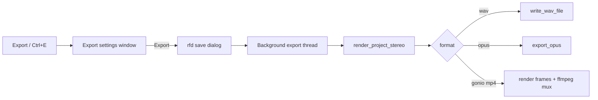

# Gonio MP4 Export + Settings Window

## Approach

Replace the current one-shot file dialog in [`export_mix`](crates/cott-daw/src/app.rs) with:

1. **Export settings window** (`egui::Window`) for format and options
2. **Save dialog** (`rfd`) only when the user confirms — for name/destination

Gonio export: offline stereo bounce → per-frame mid/side scatter plot → raw RGB frames + WAV piped into ffmpeg → H.264 MP4 with AAC/Opus audio.



## Export settings UI

New module [`crates/cott-daw/src/ui/export_dialog.rs`](crates/cott-daw/src/ui/export_dialog.rs), drawn from [`ui::draw`](crates/cott-daw/src/ui/mod.rs) when `show_export_dialog` is true.

**Window fields (stored on `UiState` / a small `ExportDialogState`):**

- **Format**: WAV | Opus | Gonio MP4 (radio / combo)
- **Tail beats** (shared; existing `ExportOptions.tail_beats`)
- **Opus bitrate** (when Opus selected)
- **Gonio** (when Gonio selected):
  - Resolution: width × height (default 1080×1080, clamped e.g. 256–2160)
  - FPS (default 30, range 1–60)
  - Persistence / decay (0–1; how fast trails fade)
  - Point intensity / gain (how bright samples plot)
  - Show axes/grid (checkbox)
  - Video CRF / quality (ffmpeg `-crf`, default ~18)

Buttons: **Cancel** closes; **Export…** opens `rfd` with the matching filter (`.wav` / `.opus` / `.mp4`) and starts the existing background-thread pattern.

Wire **Export** button + Ctrl+E to open the dialog instead of exporting immediately.

## Core: goniometer + MP4

New module [`crates/cott-core/src/visualizers/gonio.rs`](crates/cott-core/src/visualizers/gonio.rs) (+ `visualizers/mod.rs`), exported from [`lib.rs`](crates/cott-core/src/lib.rs).

**Frame model:** classic mid/side goniometer:

- `x = (L - R) * scale` (side, horizontal)
- `y = (L + R) * scale` (mid, vertical)
- Mono = vertical line; out-of-phase = horizontal

**Per video frame:**

1. Fade existing RGB buffer by `persistence` (decay toward background)
2. Plot samples for that time slice as bright points (with light bloom / neighbor add for readability)
3. Optionally draw crosshair / diamond guides

Extend [`ExportOptions`](crates/cott-core/src/export.rs) (or a sibling `GonioExportOptions`) with width, height, fps, persistence, intensity, show_guides, crf.

New `export_gonio_mp4(...)` in [`export.rs`](crates/cott-core/src/export.rs):

1. `render_project_stereo` (reuse)
2. Write temp WAV for the audio track
3. Spawn ffmpeg with stdin rawvideo:

```text
ffmpeg -y
  -f rawvideo -pix_fmt rgb24 -s WxH -r FPS -i -
  -i bounce.wav
  -c:v libx264 -pix_fmt yuv420p -crf N
  -c:a aac -b:a 192k
  -shortest out.mp4
```

4. Stream RGB24 frames for each time slice; close stdin; check status

No new image crate — raw RGB + existing ffmpeg dependency, same pattern as Opus export.

## App wiring

In [`app.rs`](crates/cott-daw/src/app.rs):

- `open_export_dialog()` sets `ui.show_export_dialog = true`
- `start_export(path)` clones project + dialog settings, spawns thread, dispatches on format (wav / opus / gonio)
- Keep `poll_export` status updates as today

## Tests

In `cott-core`:

- Unit test: gonio math maps mono L=R to near-zero side / non-zero mid
- Smoke: render a few frames from a short synthetic stereo buffer into an RGB buffer (no ffmpeg required in CI)

## Out of scope

- Live realtime goniometer panel (export only for this change)
- PNG still export
